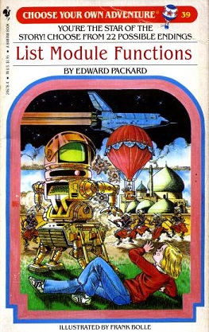

- title : F# for Scala Developers
- description : Introduction to F# for Scala developers
- author : Alfonso Garcia-Caro
- theme : night
- transition : default

***

### F# for Scala Developers
Walking into the dark side

<div>
  
  <span style="white-space: pre">   meets   </span>
  
</div>

> [Scala](http://www.meetup.com/Scala-Programming-Madrid/) and
> [F#](http://www.meetup.com/madrid-fsharp/) Madrid Meetup groups

***

### How much do Scala and F# look alike?

- Bring (non-strict) **Functional Programming** to Java and .NET
- Full **compatibility** with their host platforms
- Built-in functional libraries
- **Static safety** with type inference
- Mostly **expression** based (side-effects also allowed)
- **Open source** projects with vibrant communities

***

### How much do Scala and F# differ?

#### Scala

- Embraces both **Object Oriented** and Functional Programming
- Designed not to scare OOP developers: **curly-brace**
- Very powerful and **flexible syntax**
- Very rich **class system**
- Language team works separately from Java team

---

### How much do Scala and F# differ?

#### F#

- Multi-paradigm but **functional-first**
- Inherited from Ocaml: **indentation sensitive**
- Less flexible syntax, more focused on **consistency**
- Three flavors: **project** (.fs), **script** (.fsx) and **signature** (.fsi) files
- Language team works together (more or less) with .NET team

> Functional features like generics and tail-call
> instructions are native to the platform

***

#### Let's see some code examples...

***

### Constants, Variables and null

#### Scala

    [lang=scala]
    val a = 5                 // Type inferred constant declaration
    val b: Double = 5.0       // Explicitly typed constant declaration

    var c = 5                 // Variable declaration
    c = 10                    // Mutation

    class Point(xc: Int, yc: Int) {
      val x: Int = xc
      val y: Int = yc
    }

    val p: Point = null       // null allowed for custom classes

' 10 min

---

#### F#

    let a = 5                 // Type inferred constant declaration
    let b: float = 5.         // Explicitly typed constant declaration
    let a = 2                 // Shadowing

    // Verbosity penalty for mutability
    let mutable c = 5         // Variable declaration
    c <- 10                   // Mutation

    // Reference cells: used mainly before F# 4.0
    // to capture mutable variables in closures
    let r = ref 5
    printfn "%i" !r           // Accessing cell content
    r := 2                    // Mutating cell content

    type Point(x: int, y: int) =
      member val X = x
      member val Y = y

    // Doesn't compile, null not allowed in custom classes
    //let p: Point = null

***

### Imperative loops

#### Scala

    [lang=scala]
    for (index <- 1 to 5) {
      println(s"$index times 5 is ${index * 5}")
    }

    var index = 1
    while (index < 6) {
      println(s"$index times 5 is ${index * 5}")
      index = index + 1
    }

---

#### F#

As in Scala, **break** and **continue** are missing from the language.
Recursion or stream functions are preferred.

    for index = 1 to 5 do
      printfn "%i times 5 is %i" index (index * 5)

    let mutable index = 1
    while index < 6 do
      printfn "%i times 5 is %i" index (index * 5)
      index <- index + 1

***

### Functions

#### Scala

    [lang=scala]
    def myFunction(x: Int, y: Int) = {
      def privateFunction(z: Int) = z * 2
      privateFunction(x + y)
    }

    def curryFunction(x: Int)(y: Int) = x * y

    def highOrderFunction(f: Int => Int, y: Int) = f(y)

    def recursiveFuncion(x: Int): Int =
      if (x == 1) 1 else x * (recursiveFuncion(x - 1))

    // Function as object instead of method
    val myLambda = (x: Int, y: Int) => x * y

    // Lambda shortcut, not possible in F#
    val myLambda2: Function2[Int,Int,Int] = _*_

' 15 min

---

#### Scala

Memoize Pattern

    [lang=scala]
    val memoizeFunction = {
      val cache = scala.collection.mutable.HashMap.empty[Int,Int]
      (x: Int) => {
        if (cache.contains(x) == false) {
          println(s"Adding $x to cache...")
          cache += (x -> x * 2)
        }
        cache(x)
      }
    }

---

#### F#

    module MyMod =
      let myFunction x y = x + y

      let myFunction2 x y =
        let privateFunction z = z * 2
        // let privateFunction = fun z -> z * 2   // Same effect
        privateFunction (x + y)

      let highOrderFunction f y = f y

      let rec recursiveFuncion x =
        if x = 1 then x else x * (recursiveFuncion (x - 1))

      let memoizeFunction =
        let cache = System.Collections.Generic.Dictionary<int, int>()
        fun x ->
          if cache.ContainsKey x |> not then
            cache.Add(x, x * 2)
          cache.[x]

---

#### F#

As seen above, functions in F# are usually contained in modules (curried by default)

Optional and rest parameters are only accepted in non-curried class methods

    open System

    type MyClass =
      static member MyFunction(?x, ?y) =
        (defaultArg x 5) + (defaultArg y 10)
      static member MyFunction2([<ParamArray>] rest: int array) =
        Array.reduce (+) rest

    MyClass.MyFunction(y = 4)
    MyClass.MyFunction2(1, 2, 3)

***

### Classes

#### Scala

Classes are very powerful in Scala and different from F#:

* Singleton objects
* Traits and abstract types
* Compound types and mixins

' 20 min

---

#### F#

* F# doesn't focus on classes
* Their main purpose is compatibility with .NET Base Class Library
* Mostly same functionality as C# with different Syntax and some additional
  features (like **primary constructors**)
* Interfaces are just abstract classes without default method implementations
* No mixins, only multiple interface implementation is possible
  (extension methods are allowed)
* **Object Expressions** allow dynamic implementation of interfaces

---

### Abstract classes, interfaces and structs (value classes)

```
[<AbstractClass>]                         // If at least one member lacks
type AbstractBaseClass() =                // implementation, the class must
  abstract member Add: int -> int -> int  //  be marked as abstract
  abstract member Pi: float
  default this.Add x y = x + y            // Default implementation

type MyInterface =                        // Interfaces are just abstract
  abstract member Square: float -> float  // classes without implementations

[<Struct>]                                // Memory for structs is allocated
type MyStruct(x: float, y: float) =       // on the stack, not the heap
  member __.X = x                         // Instances are passed by value,
  member __.Y = y                         // not by reference
```
---

    type DerivedClass(param1, param2) =
       inherit AbstractBaseClass()                // Inheritance
       let mutable area = 0                       // Private field
       new(param1) = DerivedClass(param1, 5)      // Secondary constructor

       override this.Add _ _ = param1 + param2
       override this.Pi = 3.14                    // Getter-only property

       member this.Area
          with get() = area                       // Getter-Setter property
          and set(v) = area <- v
       member val Area2 = 0 with get, set         // Auto implemented property

       static member StaticValue = 5              // Static members are allowed

       interface MyInterface with                 // Interface implementation
          member this.Square x = x * x            // (always explicit)

---

### Object expressions

```
let o1 = DerivedClass(4)          // new keyword is optional
//o1.Square 5.                    // Cannot access interface methods implicitly
let o2: MyInterface = upcast o1   // Casting is automatic when passing arguments
printfn "%f" (o2.Square 5.)

let o3 =                          // Object expressions create an anonymous object
  { new MyInterface with          // implementing the interface
    member __.Square x = x ** 2. }
printfn "%f" (o3.Square 5.)

```

***

### Tuples and Records

In F#, tuples, records (lightweight classes) and discriminated unions (ADT)
are usually preferred, with logic separated in module functions.

---

#### Tuples in Scala
```
[lang=scala]
def reverse(x: Int, y: Double, z: String, u: List[Int]) = (u, z, y, x)
val myTuple = (1, 2., "hola", List(1,2,3))
val (_,_,_,_li) = myTuple              // Destructuring
myTuple._4                             // Direct access to members
//reverse(myTuple)                     // Error
```

#### Tuples in F#
```
let reverse(x, y, z, u) = (u, z, y, x)
let myTuple = 1, 2., "hola", [1;2;3]   // Parens can be omitted
let (_,_,_,li) = myTuple               // Destructuring
//myTuple._4                           // No direct acccess to members but...
reverse myTuple                        // can be destructured in function args
```

---

#### F# Records

Named tuples or lightweight classes, if you must

```
// Beware! In F# commas are only for tuples. Separating statements, members,
// list items, etc. is done with either semicolons or line breaks
type MyRecord = { id: int; qt: float; name: string; li: int list }

let myRecord = { id = 1; qt = 2.; name = "hola"; li = [1;2;3] }

myRecord.id                                 // Member access
let { id = id2; name = name2 } = myRecord   // Destructuring
let myRecord2 = { myRecord with qt = 5. }   // Copying
```

We can reach a similar effect in Scala marking constructor parameters as fields

    [lang=scala]
    class MyRecord(val id: Int, val qt: Double,
                   val name: String, val li: List[Int]) {}


***

### Algebraic Data Types and Pattern Matching

#### Scala

    [lang=scala]
    abstract class Term
    case class Var(name: String) extends Term
    case class Fun(arg: String, body: Term) extends Term
    case class App(f: Term, v: Term) extends Term

    def formatTerm(term: Term): String = term match {
      case Var(n)    => n
      case Fun(x, b) => s"^$x.${formatTerm(b)}"
      case App(f, v) => s"(${formatTerm(f)} ${formatTerm(v)})"
    }

    println(formatTerm(Fun("x", Fun("y", App(Var("x"), Var("y"))))))

' 30 min

---

#### F#

    type Term =
      | Var of string
      | Fun of string * Term
      | App of Term * Term

    // Compiler warns you if the matching is not comprehensive
    let rec formatTerm term =
      match term with
      | Var(n)    -> sprintf "%s" n
      | Fun(x, b) -> sprintf "^%s.%s" x (formatTerm b)
      | App(f, b) -> sprintf "(%s %s)" (formatTerm f) (formatTerm b)

    // Pipelining is very idiomatic in F#
    Fun("x", Fun("y", App(Var("x"), Var("y"))))
    |> formatTerm
    |> printfn "%s"

---

#### F# (a more contrived example)

```
type Shape =
  | Rectangle of width: float * length: float
  | Circle of radius: float
  | Prism of width: float * float * height: float

let rec matchShapeList = function             // Shortcut
  | [] -> None                                // Empty list
  | [shape] ->                                // Single item
    match shape with                          
    | Rectangle(length, 10.) -> Some(length)  // Constant
    | Circle r when r > 5.0 -> Some(r)        // Guard
    | _ -> failwith "Unknown shape"
  | _::rest -> matchShapeList rest            // Wildcard
```

***

#### Scala Extractor Objects

```
[lang=scala]
object Even {
  def unapply(x: Int) =
    if (x % 2 == 0) Some(x) else None
}

object Odd {
  def unapply(x: Int) =
    if (x % 2 == 0) None else Some(x)
}

println(5 match {
  case Even(_) => "Hello"
  case Odd(_) => "Goodbye"
})
```
---

#### F# Exhaustive Active Patterns
```
let (|Even|Odd|) i =
  if i % 2 = 0 then Even else Odd

match 5 with Even -> "Hello" | Odd -> "Goodbye"
|> printfn "%s"
```

#### F# Partial Active Pattern
```
let (|Integer|_|) (str: string) =
  match System.Int32.TryParse str with
  | (true, i) -> Some i | (false, _) -> None

let (|Float|_|) (str: string) =
  match System.Double.TryParse str with
  | (true, f) -> Some f | (false, _) -> None

match "Hola" with
| Integer i -> printfn "%d : Integer" i
| Float f -> printfn "%f : Floating point" f
// Appease the compiler
| _ as str -> printfn "%s : Not matched" str
```

---

#### F# Parameterized Active Patterns

Specializing the pattern by passing extra parameters

```
open System.Text.RegularExpressions
let (|ParseRegex|_|) regex str =
   match Regex.Match(str, regex) with
   | m when not m.Success -> None
   | m -> [for x in m.Groups -> x.Value] |> List.tail |> Some

let parseDate = function
  | ParseRegex @"^(\d{1,2})/(\d{1,2})/(\d{1,2})$"
              [Integer m; Integer d; Integer y]
    -> System.DateTime(y + 2000, m, d)
  | ParseRegex @"^(\d{1,2})/(\d{1,2})/(\d{3,4})$"
              [Integer m; Integer d; Integer y]
    -> System.DateTime(y, m, d)
  | ParseRegex @"^(\d{1,4})-(\d{1,2})-(\d{1,2})$"
              [Integer y; Integer m; Integer d]
    -> System.DateTime(y, m, d)
  | _ -> System.DateTime()
```

***

### Kitty Break


***

### Generics

F# generics are very similar to Scala, with a few diferences:

* **Automatic Generalization**<br />
  If the function has no dependency on the specific type of a parameter, the type is inferred to be generic

* **Statically Resolved Type Parameters**<br />
  Type parameter replaced with actual types at compile time instead of at run time

* **No generics of generics**<br />
  Generics are native to .NET platform (no erasures) but on the other hand are more limited (no type classes)

' 35 min

---

```
// Automatic Generalization
let (|>) x f = f x
// val ( |> ) : x:'a -> f:('a -> 'b) -> 'b

// Constraints
let max x y = if x > y then x else y
// val max : x:'a -> y:'a -> 'a when 'a : comparison

// Syntax for statically resolved type parameters is not beautiful
// and it's mainly intented for core library functions. However it
// can be used with inline functions for neat tricks like duck typing
let inline makeNoise (animal: ^a when ^a : (member MakeNoise: unit->unit)) =
  (^a: (member MakeNoise: unit->unit) animal)

type Dog() = member __.MakeNoise() = printfn "Guau!"
type Cat() = member __.MakeNoise() = printfn "Miau!"

makeNoise(Dog())
makeNoise(Cat())
```
---

### No generics of generics
Type classes like Functor are not allowed

```
Functor.map : ('a->'b) -> 'T<'a> -> 'T<'b>
```
<br />
Instead, `map` must be implemented for each type (or interface)

```
List.map  : ('a->'b) -> list<'a> -> list<'b>
Array.map : ('a->'b) -> array<'a> -> array<'b>
Seq.map   : ('a->'b) -> seq<'a> -> seq<'b>
```

***

### Collections

F# built-in functions and operators and focus only on a few collection types:

|                | Immutable?  | Feature         | Scala           |
| :------------: | :---------: | :-------------: | :-------------: |
| list           | Yes         | Linked list     | List            |
| seq            | Yes         | Lazy evaluation | Iterable/Stream |
| array          | No          | Random access   | Array           |
| map            | Yes         | Indexed access  | Map             |
| set            | Yes         | Unique items    | Set             |

' 40 min

---

### Fluent APIs

#### Scala

    [lang=scala]
    class Person(val name: String, val age: Int) {}
    def selectDataRows() = {
      val rnd = scala.util.Random
      for (i <- Stream.from(1))
        yield Map("name" -> s"Person$i",
                  "age" -> rnd.nextInt(99))
    }

    selectDataRows()
      .map(row => new Person(row("name").asInstanceOf[String],
                            row("age").asInstanceOf[Int]))
      .filter(_.name.startsWith("P"))
      .take(20)
      .sortBy(_.age)
      .toList

    // There're multiple libraries in Scala for collections
    // Akka-Streams, Scalaz-Stream...

---

#### F#

    type Person = { name: string; age: int }
    let getDataRows() =
      let rnd = System.Random()
      Seq.initInfinite (fun i ->
        Map [ ("name", sprintf "Person%i" i |> box)
              ("age", rnd.Next 99  |> box) ])

    // It's more idiomatic in F# to use module functions
    // and the pipe operator rather than methods

    getDataRows()
    |> Seq.map (fun row -> { name = unbox row.["name"]
                             age = unbox row.["age"] })
    |> Seq.filter (fun p -> p.name.StartsWith("P"))
    |> Seq.take 20
    |> Seq.sortBy (fun p -> p.age)
    |> Seq.toList

    // List and Array modules contain the same functions as Seq
    // Of course, pipe operator is possible in SCala too

---

### F# Comprehensions

F# allows comprensions similar to those in Haskell or Python

    let myList  =     [  for i in 1..100 do yield i*i ]
    let myArray =     [| for i in 1..100 -> i*i |]
    let mySeq   = seq {  for i in 1..100 -> i*i }

    // `->` is a shortcut for `do yield`

In Scala we would just use functions

    [lang=scala]
    List.range(1,101).map(i => i*i)

---

### Observables

F# core library also includes support for Functional Reactive Programming

```
let makeStream interval =
    let t1 = System.DateTime.Now
    let timer = new System.Timers.Timer(float interval, AutoReset=true)
    timer.Start()
    timer.Elapsed
    |> Observable.map (fun t2 -> interval, t2.SignalTime - t1)

let simultaneousStream, nonSimultaneousStream =
    Observable.merge (makeStream 3000) (makeStream 5000)
    |> Observable.pairwise
    |> Observable.partition (fun ((_,t1), (_,t2)) ->
        (t2 - t1).TotalMilliseconds < 50.)

let fizzStream, buzzStream =
    nonSimultaneousStream
    |> Observable.map (fun (ev1,_) -> ev1)
    |> Observable.partition (fun (id,_) -> id=3000)
```

---

More info about F# collections at [Scott Wlaschin's site](http://fsharpforfunandprofit.com/posts/list-module-functions/)

Check also [Phillip Trelford's presentation](http://www.slideshare.net/ptrelford/beyond-lists-functional-kats-conf-dublin-2015) about the performance of F# collection types




***

### Scala Comprehensions and F# Computation Expressions

In Scala, any type implementing _filterWith_, _map_ and _flatMap_ can be
used with **for comprehensions**. This allows, for example, dealing with async
operations in a monadic way.

    [lang=scala]
    val usdQuote = Future { connection.getCurrentValue(USD) }
    val chfQuote = Future { connection.getCurrentValue(CHF) }

    val purchase = for {
      usd <- usdQuote
      chf <- chfQuote
      if isProfitable(usd, chf)
    } yield connection.buy(amount, chf)

    purchase onSuccess {
      case _ => println("Purchased " + amount + " CHF")
    }

' 50 min

---

In F#, this can be done using **computation expressions**

    // Parallel I/O
    let fetchUrlAsync url = async {
      let req = System.Net.WebRequest.Create(System.Uri url)
      use! resp = req.AsyncGetResponse()
      use stream = resp.GetResponseStream()
      use reader = new System.IO.StreamReader(stream)
      return reader.ReadToEnd()
    }

    [ "http://fsharp.org/"; "http://www.scala-lang.org/" ]
    |> List.map fetchUrlAsync
    |> Async.Parallel
    |> Async.RunSynchronously
    |> printfn "%A"

Computation expressions convert language constructs like
*let*, *use*, *do*, *for* or *try* in [syntactic sugar](http://fsharpforfunandprofit.com/posts/computation-expressions-intro/)
for continuation passing style operations

---

F# core has **Asynchronous Workflows** built-in

    // Parallel CPU
    let rec fib x =
      if x <= 2
      then 1
      else fib(x-1) + fib(x-2)

    let fibs =
      [ for i in 0..40 -> async { return fib(i) } ]
      |> Async.Parallel
      |> Async.RunSynchronously
      |> printfn "%A"

*Async<'T>* is lazy, it will only start running after
calling *Async.Start* or *Async.RunSynchronously*

---

### Custom computation expressions

```
type MaybeBuilder() =
  member __.Bind(x,f) = Option.bind f x
  member __.Return v = Some v
  member __.ReturnFrom o = o
let maybe = MaybeBuilder()

let riskyOp x y =
  if x + y < 100 then Some(x+y) else None

let execMaybe x = maybe {
  let! a = riskyOp x (x+1)
  let! b = riskyOp a (a+1)
  let! c = riskyOp b (b+1)
  let! d = riskyOp c (c+1)
  return d
}    
execMaybe 5
```

Besides _Bind_ and _Return_, there are [other methods](http://fsharpforfunandprofit.com/posts/computation-expressions-builder-part1/)
wich can be implemented by custom computations expressions
like _Zero_, _Yield_, _Combine_, _For_, _While_ or _Try_

---

### Query expressions

Query expressions provide support for LINQ in F#

```
query {
    for n in db.Student do
    join e in db.CourseSelection on
          (n.StudentID = e.StudentID)
    count        
}
```


They express transformations on a data source wich can
be translated to another language, usually SQL

    [lang=sql]SELECT COUNT(*) FROM
    Student JOIN CourseSelection
    ON Student.StudentID = CourseSelection.StudentID

***

#### And now for a couple of unique F# features...

***

### Units of Measure

    [<Measure>] type km           // Define the measure units
    [<Measure>] type mi           // as simple types decorated
    [<Measure>] type h            // with Measure attribute

    let speed = 90<km> / 1<h>     // Can be combined through
    let speed' = 55<mi> / 1<h>    // arithmetic operations

    let v1, v2, v3 = 3.1<km/h>, 2.7<km/h>, 1.5<mi/h>
    let sum = v1 + v2
    //let sum' = v1 + v3          // Error: doesn't compile

    // Can be used in a generic way
    type Vector3D<[<Measure>] 'u> =
      { x: float<'u>; y: float<'u>; z: float<'u> }

Measure annotations disappear after compilation and thus they have no performance penalty

(Cannot be retrieved by Reflection though)

' 60 min

***

### Type Providers

Static types generated dynamically


---

#### JSON


---

#### World Bank API REST


Watch [this presentation](http://sergey-tihon.github.io/Talks/typeproviders#/) to know more about type providers

Type providers can also be emulated with [Scala macros](http://docs.scala-lang.org/overviews/macros/typeproviders.html)

***

### Flagship Projects

|               | Scala          | F#             |
| :-----------: | :------------: | :------------: |
| Web           | [Play](https://www.playframework.com/), [Lift](http://liftweb.net/) | [Suave](http://suave.io/)       |
| Actors        | [Akka](http://akka.io/)            | [Akka.net](http://getakka.net/) |
| Big Data      | [Spark](http://spark.apache.org/)  | [Mbrace](http://www.m-brace.net/), [Prajna](http://msrccs.github.io/Prajna/) |
| Visualization | [Zeppelin](https://zeppelin.incubator.apache.org/) | [FsLab](http://fslab.org/) |

> More at the [F# space for incubating open community projects](http://fsprojects.github.io/)

' 1 h 10 min

***

### Other platforms

#### Scala

- [Scala.js](http://www.scala-js.org/)
- [Android](http://macroid.github.io/ScalaOnAndroid.html)

<br />
<br />

#### F#

- JS/HTML5: [FunScript](http://funscript.info/) and [WebSharper](http://websharper.com/)
- [Mobile platforms with Xamarin](http://fsharp.org/guides/apps-and-games/index.html)

***

### Want more F#?

* [F# foundation](http://fsharp.org/)
* [F# for Fun and Profit](http://fsharpforfunandprofit.com/)
* [F# Weekly](https://sergeytihon.wordpress.com/category/f-weekly/)
* [F# on Twitter](https://twitter.com/search?q=%23fsharp)

> These slides were made with <a href=""> [FSReveal](http://fsprojects.github.io/FsReveal/) and no kittens were harmed in the process

***

### And here comes the unasked-for advice!

Remember to focus away and [blink regularly](https://www.uihealthcare.org/2column.aspx?id=225650) when staring at the screen for a long time

<div style="text-align: right">
  <p>Ping me!</p>
  <p>@alfonsogcnunez</p>
  <p>[Github](https://github.com/alfonsogarciacaro), [SlideShare](http://www.slideshare.net/alfonsogarciacaro7)</p>
</div>

' 1 h 15 min
